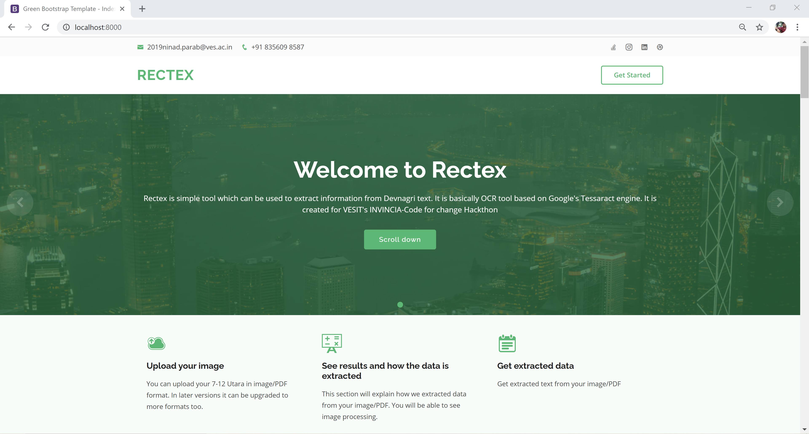
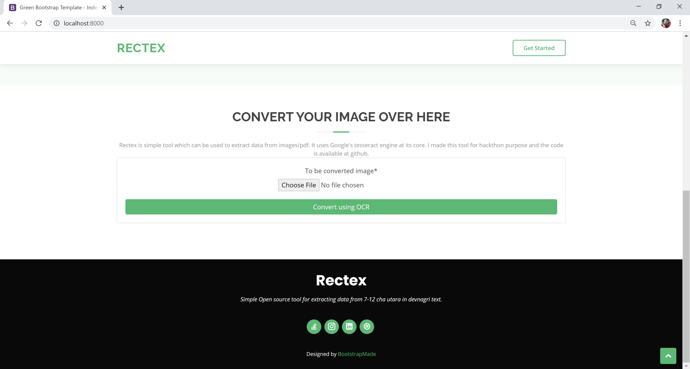
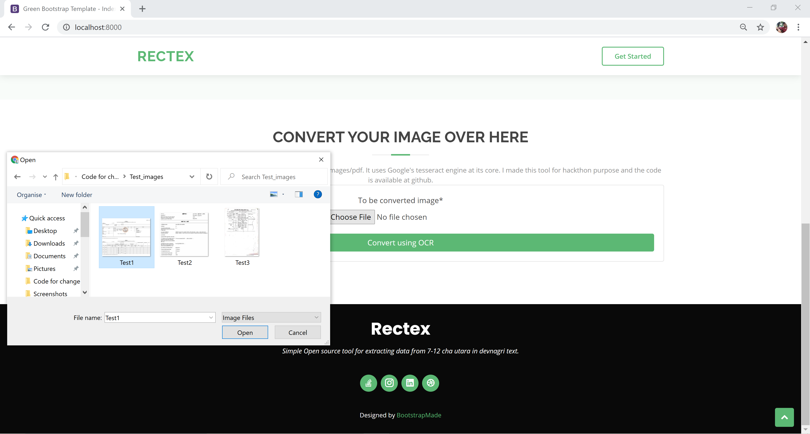
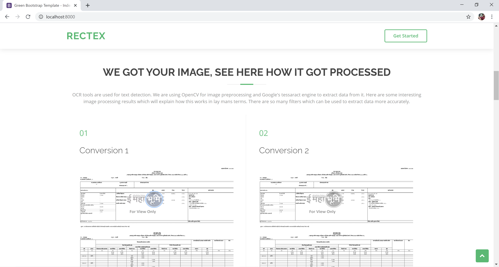
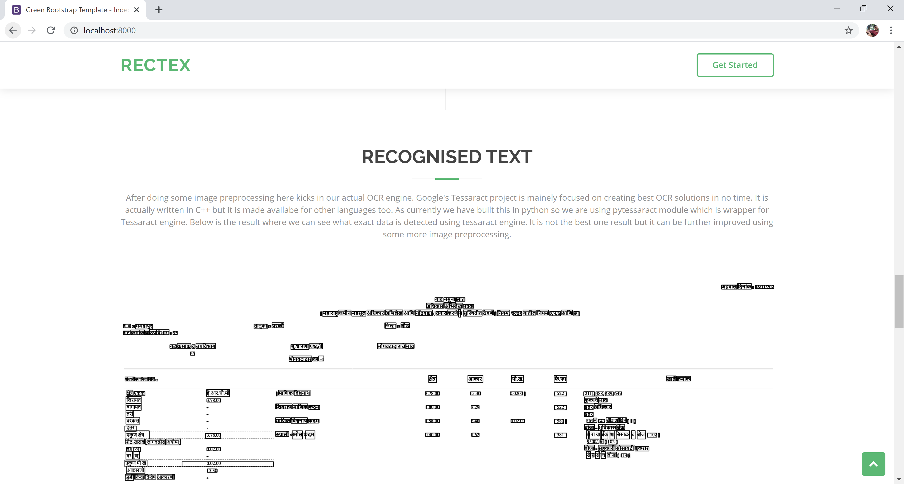
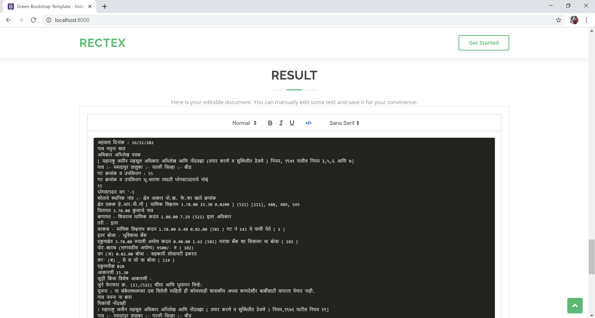

# Rectex: A simple tool to extract Devnagri text from documents
### Objective of this project
Well this project is created for VESIT's Invincia:Code for Change hackathon. The problem statement is as follows: 
The problem statement is to develop a tool, application or script
that can process the required input document in the form of PDF
or Image file and extract readable text from it.
The idea behind this problem statement is to extract data from
image/pdf using google’s open source tessaract engine and some image preprocessing magic. 
So this project focuses on Web app.

Following technology stack is used to create this simple yet useful tool. 
1. [Google tessaract project](https://github.com/tesseract-ocr/) 
2. [Pytesseract wrapper module](https://pypi.org/project/pytesseract/)
3. [Opencv](https://opencv.org/)
4. [Django](https://www.djangoproject.com/)
5. [Bootstrap4](https://getbootstrap.com/docs/4.0/getting-started/introduction/)
6. [Quilljs](https://quilljs.com/)
7. [Green by Bootstrapmade](https://bootstrapmade.com/green-free-one-page-bootstrap-template/)
8. [Django Crispy forms](https://django-crispy-forms.readthedocs.io/en/latest/)
9. [Pillow](https://pypi.org/project/Pillow/)

# How to use this tool.
This tool is pretty simple to use

## Step 1: Read the instructions(obviously :P)

## Step 2: Upload your image.

## Step 3: Click on conversion button.

## Step 4: See detailed explanation of image processing.

## Step 5: See how text got detected.

## Step 6: Download converted result in docx format.

# Running this project on local machine

First install Tessaract engine on your machine. For detailed guide you can follow their tutorial over [here](https://tesseract-ocr.github.io/tessdoc/Compiling.html).

 Make sure you have python 3.7 installed.
 
 1. Create a folder where you can store your project.
 2. After that go to that path in console(cmd/shell/bash/powershell)
 
    `cd path_to_your_local_folder`
 
 3. Clone this repository in that folder by typing
 
    `https://github.com/k33da-lets-debug/CodeForChange.git`
 
 4. Install virtual environment:
    `pip install virtualenv`
 
 5. Creating virtual environment:
    `virtualenv venv`
 
 6. Activating virtual environment:
    `.\venv\Scripts\activate.bat`
    Note: you will see (venv) on very left side of your console that means your virtual environment is now activate (or check it with 'pip freeze').
 
 7. Installing dependencies:
    Note: Check if you got "project\requirements.txt" inside your cloned folder.
 
    `pip install -r requirements.txt`
 
 8. Running this project:
    First go to path where manage.py is located by typing
    `cd path_to_project_where_manage_dot_py_is_located`
 
    Now run this project by typing
    `python manage.py runserver`
    
    You can now go to localhost:8000 to see this project running.
 
